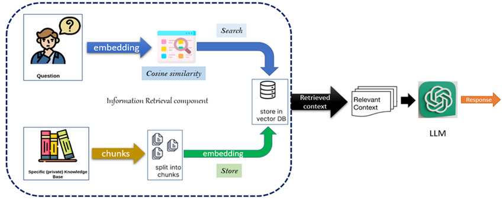

# moodsandfoods
by Pauline-7

## annattoboost - data science - final project

Here you find the final project of a 3 months spiced academy data science course. A simple RAG/LLM model in a python script based on a notebook. 

The topic has been chosen independently. The goal was to set up a **nutritional recommendation tool based on your mood**. 

## Project description 
In the presentation folder you can see the slides of the final presentation. This is where business problem, motivation, and methodology are visualized and partly explained. 

The model consists mostly of the following (all packages can be found in *requirements.txt* file incl versions):
- **Count vectorizer** & **cosine similarity** (Skikit-learn)
- **Retrieval augmented generation (RAG)** with (Langchain and Llama)
    - Limitations of LLMs

        - know nothing outside training data, e.g., up-to-date information, classified/private data
        - not specialized in specfic use cases
        - tend to hallucinate confidently, possibly leading to misinformation
        - produce black box output: do not clarify what has led to the generation of particular content

    - Fine Tuning

        - enhances model performance for specific use case through Transfer Learning with additional data
        - changes model parameters, enhancing speed and reducing cost for specific task
        - powelful tool for:
            + incorporating non-dynamic or past data
            + specific industries with nuances in writing style, vocabulary, terminology
            - cutoff issue persists in absence of up-to-date information

    - Retrieval Augmented Generation (RAG)

        - increases model capabilities through:
            + **retrieving** external and up-to-date information
            + **augmenting** the original prompt given to the model
            + **generating** response using context plus information
        - ground llm model parameters remain unchanged (no Transfer Learning)
        - powerful tool for making use of dynamic up-to-date information
        - white box output: provides transparency behind the model without hallucination

#### RAG Framework



#### [LangChain](https://python.langchain.com/docs/introduction/)

> framework for developing applications powered by LLMs

#### [FAISS (Facebook AI Similarity Search)](https://ai.meta.com/tools/faiss/)

>  library allowing storage of contextual embedding vectors in vector database and similarity search

#### [Groq](https://groq.com/about-us/)

> engine providing fast AI inference (conclusion from brand new data) in the cloud


## Notebook instructions
The notebook can be read as follows: 
* **Load the environment:** To be able to run all codes you need to set up the environment based on the requirements.txt file as described below. 

### Setup:

Use the requirements file in this repo to create a new environment. Additional requirements: pyenv with Python: 3.11.3.

```BASH
make setup

#or

pyenv local 3.11.3
python -m venv .venv
source .venv/bin/activate
pip install --upgrade pip
pip install -r requirements.txt
```

The `requirements.txt` file contains the libraries needed for deployment.. of model or dashboard .. thus no jupyter or other libs used during development.

* **Run first notebook:**
    In order to load all necessary csv and data files for the py streamlit skript you need to run the first notebook called *moodsandfoods.ipynb* this is were data is preprocessed and and restored if needed. 
* **Set up streamlit:**
    To run the streamlit app and be able to use the tool, go to the terminal, navigate to the *pages* folder, and run the command "*streamlit run moodsandfoods_presentation.py*" the streamlit app will open
* **Now you're able to use the online tool!**


## Enjoy clicking through and always remember: 

## Don't be moody when you can be foody  :)


